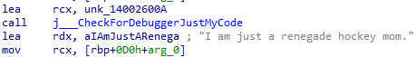
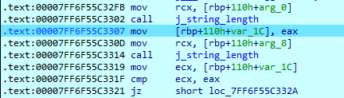
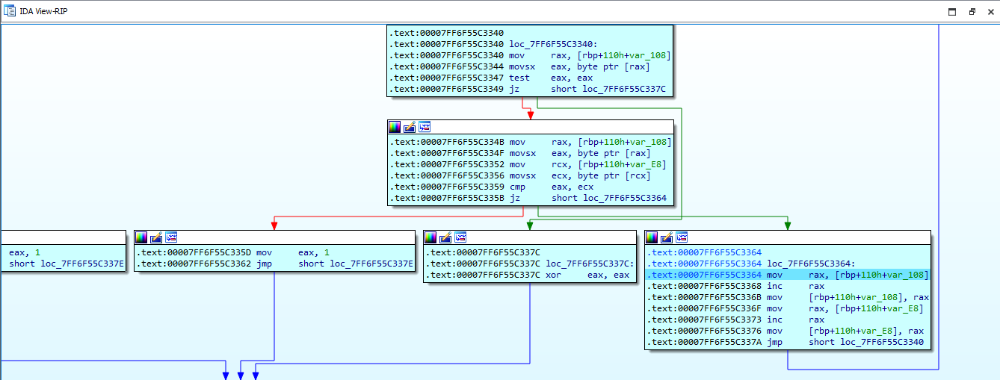

# Phase 1 — String Comparison

## Objective

Phase 1 requires the user to input a specific string that perfectly matches a reference string embedded in the binary's read-only memory. While extracting the target string is trivial, analyzing the comparison implementation reveals the exact memory, length, and logic constraints the input must satisfy at the assembly level.

## 1. Identifying the Expected String

At the start of `phase_1`, a pointer to the reference string is loaded into the appropriate register (e.g., `RDX`, following the specific calling convention ABI used by this binary). The target string is located at a fixed memory offset and reads:

```text
I am just a renegade hockey mom.
```
 
The user-provided input is loaded into the corresponding register (`RCX`), and the function then invokes `strings_not_equal`, as seen in the disassembly snippet below:
 

 
## 2. Inside `strings_not_equal`
 
The first operation within `strings_not_equal` is calculating the lengths of both strings via a `string_length` subroutine.


 
As shown in the debugger state above, the reference string has a length of `0x20 (32 bytes)`. The user-provided string's length is computed similarly, and the two lengths are compared before any character-level check occurs. If the lengths differ, the strings are immediately flagged as unequal, bypassing further inspection.
 
Conceptually, this maps to:
 
```c
if (strlen(input) != strlen(expected))
    return 1;
```
 
This gives us the first constraint:
 
> **The input must be exactly 32 characters long.**
 
## 3. Byte-by-Byte Comparison
 
If the length validation passes, `strings_not_equal` proceeds to a byte-by-byte comparison loop.
 

 
During each iteration, the function loads the current byte from both strings and checks for the null terminator. If a byte pair differs, the function returns a non-zero value immediately, optimizing out unnecessary scanning. If the bytes match, both pointers increment, and the loop continues.
 
Conceptually, the loop is equivalent to:
 
```c
while (*input != '\0') {
    if (*input != *expected)
        return 1;
 
    input++;
    expected++;
}
 
return 0;
```
 
This logic mirrors a standard strcmp implementation: a length-then-content comparison compiled down to a tight loop with an early exit on mismatch.
 
## 4. The Return Value
 
The return value of `strings_not_equal` dictates the execution path in `phase_1`:
 
```
0     → strings are equal
non-0 → strings differ
```
 
To avoid triggering the bomb, the successful execution path requires:
 
```
strings_not_equal(input, expected) == 0
```
 
Thus, the required input string is exactly the reference string:
 
```
I am just a renegade hockey mom.
```