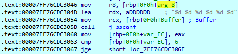
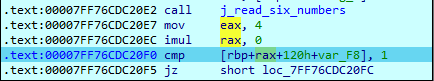
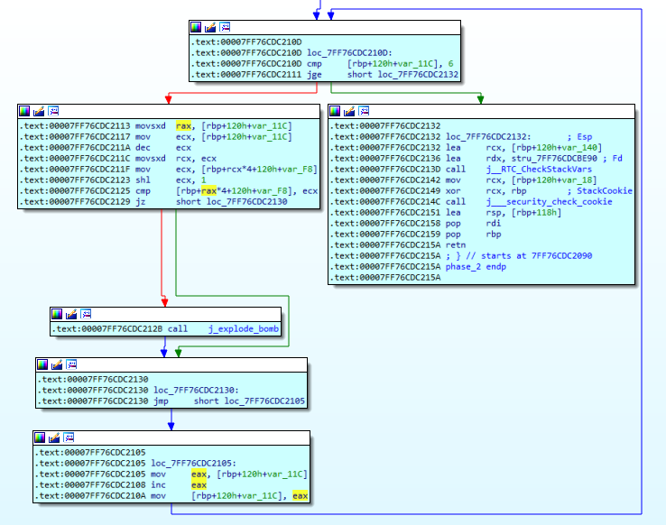

# Phase 2 — Input Sequence
  
## Objective
 
Phase 2 requires the user to input a sequence of six integer values. The objective of this analysis is to deduce the mathematical relationship enforced between these integers by examining the underlying loop mechanics, array indexing, and bitwise instructions, rather than simply brute-forcing the final sequence.
 
## 1. Determining the Number and Type of Inputs
 
Execution begins by loading the address of a format string into the appropriate argument register for a reading function. The format string is explicitly defined as:
 
```text
"%d %d %d %d %d %d"
```
 
As shown in the disassembly below, the input is parsed using `sscanf`.


 
The return value from `sscanf`, which represents the number of successfully assigned input fields, is stored in the `EAX` register. The function immediately compares this return value against `6`.
 
Conceptually, this maps to:
 
```c
if (sscanf(Buffer, "%d %d %d %d %d %d", ...) < 6)
    explode_bomb();
```
 
This gives us the first constraint:
 
> **Exactly six integers must be successfully parsed.**
 
## 2. Inspecting the First Value
 
Once the parsed integers are stored in a local stack buffer, the phase accesses the first integer to validate it.   As seen in the following snippet, the assembly utilizes a scale factor of `4` when calculating the memory address of an element.
 

 
A scale factor of `4` perfectly aligns with iterating through an array of 32-bit integers, given that `sizeof(int) = 4 bytes`. Consequently, the six parsed values can be conceptually modeled as:

```c
int numbers[6];
```
 
The instruction compares the first value in this array against `1`. The successful execution path requires:
 
```c
numbers[0] == 1;
```
 
This yields the first concrete value of the sequence:
 
> **The first integer must be `1`.**
 
## 3. Following the Loop
 
The core logic of Phase 2 resides in the subsequent loop. After validating that the initial value is 1, the function enters a loop that repeatedly:   
1. Obtains the current integer value.   2. Doubles the value.   
3. Advances the pointer to the next element in the array.   
4. Compares the calculated doubled value against this next input.   

The multiplication operation is highly optimized, utilizing a logical left shift (`shl`) rather than a standard `imul` instruction:
 

 
A left shift by one bit is equivalent to multiplying an integer by two:
 
```
value << 1  ≡  value * 2
```
 
Identifying the `shl` instruction is critical because it explicitly dictates a strict doubling relationship. The constraint enforced for each subsequent element is strictly:
 
```c
numbers[i] == numbers[i - 1] * 2;
```
 
## 4. Reconstructing the Constraint
 
Combining the initial check with the loop gives us:
 
```
numbers[0] = 1
numbers[1] = numbers[0] × 2
numbers[2] = numbers[1] × 2
numbers[3] = numbers[2] × 2
numbers[4] = numbers[3] × 2
numbers[5] = numbers[4] × 2
```
 
The phase is effectively enforcing:
 
```c
numbers[0] = 1;
 
for (int i = 1; i < 6; i++) {
    if (numbers[i] != numbers[i - 1] * 2)
        explode_bomb();
}
```
 
Which resolves to the required sequence:
 
```
1 2 4 8 16 32
```