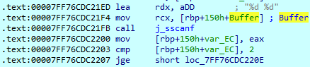
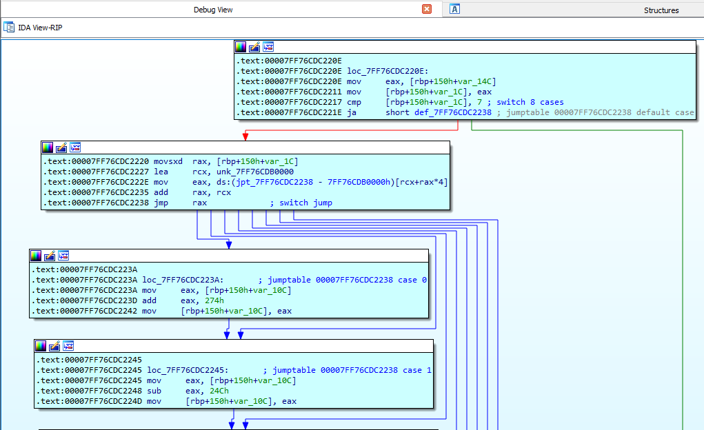
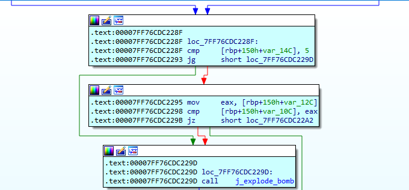

# Phase 3 — Reconstructing a Switch-Case Jump Table

## Objective

Phase 3 accepts two integer inputs. The first integer selects a specific execution branch, and the second integer is validated against a target value dictated by that selected branch. The primary reverse-engineering challenge involves analyzing how the compiler translates a high-level `switch` statement into a bounds-checked indirect jump table at the assembly level.

## 1. Input Format and Validation

Execution begins by loading the address of a format string designed to capture two integer inputs.



This operation maps directly to the following C logic:

```c
int first;
int second;

sscanf(buffer, "%d %d", &first, &second);
```

The return value from `sscanf` is checked against `2`.

This gives us the first constraint:

> **Two integers must be successfully parsed.**

## 2. Restricting the First Input

Before accessing the jump table, the first input is constrained to the valid range of `0` through `5`. This validation check prevents arbitrary out-of-bounds memory accesses during the indirect jump:

```
if (first < 0 || first > 5)
    explode_bomb();
```

## 3. Analyzing the Jump Table

If the bounds check passes, the first input serves as an index into a table of memory addresses (the jump table), each pointing to a distinct block of instructions.



The compiler transformed the original `switch` statement into a contiguous table containing seven theoretical entries (cases `0` through `6`). However, the strict > `5` bounds check detailed in Section 2 renders the seventh entry (case `6`) entirely unreachable; it exists in the binary's compiled jump table, but no valid user input can trigger it.

## 4. Following the Individual Cases

Once the jump table structure is identified, each reachable branch can be analyzed independently. Each case assigns a specific constant value to a register, which is subsequently compared against the second user-provided integer.



The structure is therefore approximately:

```c
switch (first) {
    case 0: expected = ...; break;
    case 1: expected = ...; break;
    // ...
    case 5: expected = ...; break;
}

if (second != expected)
    explode_bomb();
```

## 5. Reconstructing the Phase Logic

Integrating the bounds check, jump table indexing, and case-specific constants reveals the complete logic of Phase 3:

```c
int expected;

if (sscanf(buffer, "%d %d", &first, &second) < 2)
    explode_bomb();

if (first > 5)
    explode_bomb();

switch (first) {
    case 0: expected = 0x25A;      break;
    case 1: expected = 0xFFFFFFE6; break;
    case 2: expected = 0x232;      break;
    case 3: expected = 0xFFFFFF82; break;
    case 4: expected = 0;          break;
    case 5: expected = 0xFFFFFF82; break;
}

if (second != expected)
    explode_bomb();
```

Phase 3 operates fundamentally as a lookup mapping, where the first input strictly dictates the required second input.

## 6. Deriving the Solution

By extracting the constants from every reachable branch in the disassembly, the complete set of valid input pairs can be mapped out:

| First input | Selected case | Required second input (hex) | Required second input (decimal) |
|---|---|---|---|
| 0 | Case 0 | `0x25A` | `602` |
| 1 | Case 1 | `0xFFFFFFE6` | `-26` |
| 2 | Case 2 | `0x232` | `562` |
| 3 | Case 3 | `0xFFFFFF82` | `-126` |
| 4 | Case 4 | `0x0` | `0` |
| 5 | Case 5 | `0xFFFFFF82` | `-126` |

Because `sscanf` parses the input with the `%d` format specifier, the second value must be entered as a signed decimal integer. Constants such as `0xFFFFFFE6` and `0xFFFFFF82` represent the 32-bit two's-complement forms of `-26` and `-126`, respectively. Since every reachable case leads to a valid integer pair, this phase has six valid solutions rather than a single correct answer. Inputting any of the documented pairs (such as 0 602) successfully clears the phase.