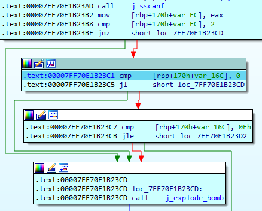
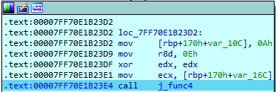
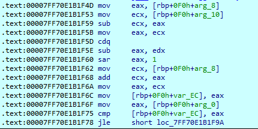
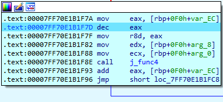
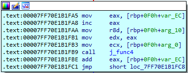

# Phase 4 — Reconstructing a Recursive Binary Search

## Objective

Phase 4 accepts two integer inputs. The first integer must fall within the strictly enforced range of `0` through `14` and is passed as an argument to a recursive subroutine, `func4`. The second integer is subsequently validated against the cumulative return value of this recursive function. The core reverse-engineering challenge involves analyzing the recursive branching, identifying the midpoint calculation, and determining how the return value is mathematically accumulated. 

## 1. Input Format and Range Validation

The phase utilizes `sscanf` to parse the user's input buffer, strictly verifying that exactly two integers are successfully read. Immediately after parsing, the first input is subjected to a bounds check to ensure it lies within `0` and `14` inclusive.



This initial logic maps directly to the following C structure:

```c
if (sscanf(Buffer, "%d %d", &first, &second) != 2)
    explode_bomb();

if (first < 0 || first > 14)
    explode_bomb();

if (func4(first, 0, 14) != second)
    explode_bomb();
```

## 2. Identifying the Arguments

At the start of `func4`, the three arguments are saved from the Windows x64 argument registers. Their roles are recovered from how each is used in the comparisons and recursive calls:

| Register | Stack slot | Role |
|---|---|---|
| `ECX` | `arg_0` | target |
| `EDX` | `arg_8` | lower bound |
| `R8D` | `arg_10` | upper bound |

Based on these registers, the function signature is definitively structured as `func4(target, low, high)`.



## 3. The Midpoint Calculation

Inside `func4`, a midpoint is calculated by halving the difference between the upper and lower bounds, and adding the result back to the lower bound.



At the assembly level, this division is optimized using a sequence of `cdq`, `sub`, and `sar` instructions. This specific pattern represents the compiler's standard method for executing a signed division by two that rounds toward zero. The resultant midpoint is stored in the local stack variable `var_EC`.

Conceptually, this operation is equivalent to:

```c
int mid = low + (high - low) / 2;
```

## 4. The Recursive Branches

Following the midpoint calculation, `func4` evaluates `mid` against the `target` value, which dictates execution flow down one of three distinct paths:

| Condition | Action |
|---|---|
| `mid > target` | search the lower half: `func4(target, low, mid - 1)` |
| `mid < target` | search the upper half: `func4(target, mid + 1, high)` |
| `mid == target` | base case: return `mid` |

The important instruction is the one right after each recursive call returns:

```
add eax, [var_EC]      ; result += mid
```

This instruction mandates that the current midpoint is added to the recursive result, meaning the function dynamically accumulates a sum during its traversal.

## 5. The Reconstructed Function

Combining the argument mapping, midpoint logic, and accumulated returns yields the complete decompiled C logic:

```c
int func4(int target, int low, int high)
{
    int mid = low + (high - low) / 2;

    if (mid > target)
        return func4(target, low, mid - 1) + mid;

    if (mid < target)
        return func4(target, mid + 1, high) + mid;

    return mid;
}
```




## 6. What the Return Value Represents

While `func4` operates structurally as a binary search, it does not simply return a boolean success flag or an index. Instead, it mathematically sums every midpoint visited from the initial search interval all the way down to the target.   For example, given the initial bounds of `0` to `14`, searching for a target of `1` visits the midpoints `7`, `3`, and finally `1`. Therefore, the function returns:

```
7 + 3 + 1 = 11
```

## 7. Deriving the Solution

Because the valid first inputs form a small range, the required second input for each candidate is the midpoint sum along its search path. The pair used to clear the phase:

| First input | Midpoint path | `func4` result | Required second input |
|---|---|---|---|
| `3` | `7 → 3` | `10` | `10` |