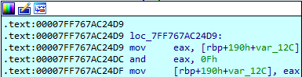
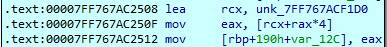

# Phase 5 — Following an Indirect Array Traversal

## Objective

Phase 5 requires two integer inputs. The core reverse-engineering challenge involves analyzing an indirect, pointer-chasing array traversal. The first input is bitwise-masked to form a safe starting index, and each subsequent value read from the array serves simultaneously as an accumulator value and the index for the next memory lookup. 

## 1. Input Format and Validation

Consistent with previous phases, the function initiates by parsing the input buffer for two integers and validating the `sscanf` return value:

```c
if (sscanf(input, "%d %d", &first, &second) < 2)
    explode_bomb();
```

## 2. Masking the First Input

The first integer is subjected to a bitwise AND operation with `0xF` (`1111` in binary).



```
and ..., 0xF
```

This operation isolates the lowest four bits of the input, effectively forcing the resulting index into a strict `0–15` range regardless of the original integer's size:

```c
index = first & 0xF;
```

For instance:

```
 5 & 15 =  5
10 & 15 = 10
15 & 15 = 15
16 & 15 =  0
17 & 15 =  1
```

This guarantees the array traversal starts from one of 16 bounded positions without requiring an explicit compare-and-branch bounds check.

## 3. Excluding Index 15

While the bitwise mask permits a starting index of `15`, the immediate loop condition `(cmp [rbp+190h+var_12C], 0Fh)` prevents it from executing. If the starting index is `15`, the traversal loop is skipped entirely, leaving the iteration counter at `0`.   

The program then detonates at the post-loop validation check, which requires the counter to equal `15` (`if (count != 15)`). Consequently, the valid starting index is narrowed exclusively to the `0–14` range.

## 4. The Indirect Array Traversal

The isolated index is used to access a 32-bit integer array statically located at memory address `unk_7FF767ACF1D0`.



The disassembly confirms the data size via scaled index addressing (`mov eax, [rcx+rax*4]`), where the `*4` multiplier calculates the exact byte offset for 32-bit integers.

The value retrieved from this memory address is not just static data; it immediately becomes the index for the next lookup. This creates a chained, indirect traversal:

```
start
  ↓
array[start]
  ↓
array[array[start]]
  ↓
array[array[array[start]]]
  ↓
...
```

Using an illustrative example (not the actual binary data):

```
index:  0  1  2  3  4  5 ...
value:  3  7  1  9  5  2 ...
```

starting at index 0 gives `0 → 3 → 9 → ...`.

## 5. The Iteration Counter and Accumulator

The loop maintains two extra variables alongside the index:

- **A counter**, incremented each iteration. From the assembly, the traversal is bounded to **15 iterations**.
- **An accumulator**, which adds each value encountered.

Each loop iteration simultaneously calculates the next memory hop and adds the current hop's value to the total sum.

## 6. Reconstructing the Phase Logic

Integrating the bitwise masking, array addressing, and loop constraints yields the following structural logic:

```c
int index = first & 0xF;
int count = 0;
int sum = 0;

while (index != 15) {
    count++;
    index = array[index];
    sum += index;
}

if (count != 15)
    explode_bomb();

if (sum != second)
    explode_bomb();
```

Because this phase relies on static data, the most reliable methodology for solving it involves dumping the array from memory using IDA and tracing the traversal chain manually for a candidate starting index (`0-14`). The final accumulated sum dictates the required second input, while the chosen starting index dictates the required first input.