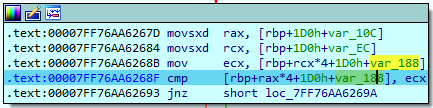
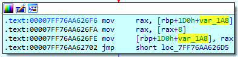

# Phase 6 — Reconstructing and Reordering a Linked List

## Objective

Phase 6 accepts a sequence of six integer inputs. The function validates these inputs, utilizes them as index selectors to extract nodes from an embedded linked list, stores the corresponding node pointers in a temporary stack array, and rewires the list based on the user-specified order. Finally, the phase verifies that the newly ordered linked list satisfies a strict descending value constraint.

## 1. Validating the Inputs

The phase begins by enforcing two primary constraints on the input sequence: each integer must be a valid node index (`1–6`), and each must be mathematically distinct from all preceding inputs. 



Conceptually, this validation is an $O(n^2)$ duplicate check mapped to the following C logic:

```c
for (int i = 0; i < 6; i++) {
    if (input[i] < 1 || input[i] > 6)
        explode_bomb();

    for (int j = 0; j < i; j++) {
        if (input[i] == input[j])
            explode_bomb();
    }
}
```

Because there are six inputs bounded strictly between `1` and `6` with no duplicates allowed, the input must logically be a permutation of the digits 1 through 6. This reduces the problem space from guessing arbitrary integers to simply identifying the correct ordering of six existing nodes.

## 2. The Linked-List Structure

After validation, the phase interacts with a statically allocated linked list. Analyzing the memory offsets in the disassembly reveals the structure of each node: it contains a 32-bit integer value and a 64-bit pointer to the next node, requiring 4 bytes of padding for memory alignment.



The struct can be conceptually defined as:

```c
struct node {
    int value;
    // padding/unused 4 bytes to align pointer
    struct node *next; // located at offset +8
};
```

To translate a user-supplied index into a concrete memory pointer, the function traverses the `next` pointers starting from the head node until it reaches the requested depth:

```c
node = node1;
for (int j = 1; j < requested_index; j++)
    node = node->next;
```

## 3. Converting Inputs into Node Pointers

As the phase iterates through the user's permutation, it locates the corresponding node for each input and stores its memory address sequentially in a temporary array on the stack frame:

```c
nodes[i] = find_node(input[i]);
```

For instance, if the input sequence were `5 2 6 1 4 3`, the stack array would populate as follows:

```
nodes[0] → node 5
nodes[1] → node 2
nodes[2] → node 6
nodes[3] → node 1
nodes[4] → node 4
nodes[5] → node 3
```

At this stage, the input hasn't modified any nodes. It only determines which node pointers go into the array, and in what order.

## 4. Relinking the Nodes

With the stack array populated, the phase proceeds to systematically rewire the original linked list:

```c
for (int i = 0; i < 5; i++)
    nodes[i]->next = nodes[i + 1];

nodes[5]->next = NULL;
```

Applying this to the previous example sequence, the original list's pointers are overwritten to reflect the user's order:

```
node 5 → node 2 → node 6 → node 1 → node 4 → node 3
```

## 5. The Final Comparison

In the final verification step, the phase traverses the newly reordered list and compares the values of adjacent nodes:

```c
for (int i = 0; i < 5; i++) {
    if (nodes[i]->value < nodes[i + 1]->value)
        explode_bomb();
}
```

This logic dictates that the node values must be strictly non-increasing (descending) in their new configuration:

```
nodes[0]->value >= nodes[1]->value >= ... >= nodes[5]->value
```

## 6. Deriving the Solution
Because the phase strictly checks if the user's permutation successfully sorts the list in descending order, dynamic execution is no longer necessary. The solution can be derived statically by dumping the linked list from memory and sorting the nodes by their data values.   

Extracting the actual node values from the binary yields:

```
node 1 → 530
node 2 → 450
node 3 → 533
node 4 → 915
node 5 → 935
node 6 → 512
```

Sorting these values in strictly descending order results in the sequence `935, 915, 533, 530, 512, 450`. Mapping these sorted values back to their respective node indices directly provides the required input permutation: `5 4 3 1 6 2`.