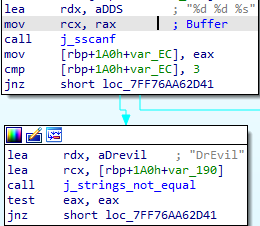
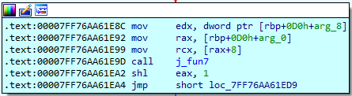
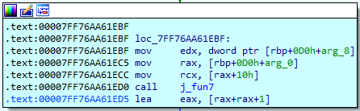

# Secret Phase — Reconstructing a Binary Search Tree

## Objective

Unlike the six standard phases, the Secret Phase is not sequentially executed; its entry point is obscured within `phase_defused`. Accessing it requires discovering a hidden string trigger. Once unlocked, the phase challenges the analyst to reverse-engineer a recursive Binary Search Tree (BST) traversal and mathematically unwind the required search path from a target return value.

## 1. Unlocking the Entry Point

Execution naturally reaches `phase_defused` after the six standard phases are cleared. However, clearing the phases does not automatically trigger the Secret Phase; `phase_defused` executes additional hidden logic. 



The function re-evaluates a previously stored input string, attempting to parse three specific fields. The binary targets Phase 4's input buffer by applying an index multiplier of `3` (`imul rax, 3`) to an 80-byte (`0x50`) string array. It uses the format string `%d %d %s` and compares the parsed string field against `DrEvil`:

```c
if (sscanf(phase_4_input, "%d %d %s", &a, &b, str) == 3) {
    if (strcmp(str, "DrEvil") == 0)
        secret_phase();
}
```

To unlock the gate, the original Phase 4 input must be appended with the trigger string (e.g., `3 10 DrEvil`).

## 2. The Secret Phase Input

Once inside `secret_phase`, the function reads a new line of input via `read_line`, parses it into an integer using `atoi`, and enforces a strict bounds check:

```c
if (input < 1 || input > 1001)
    explode_bomb();
```

The validated integer is then passed as an argument to `fun7`, along with a pointer to the root of a data structure:

```c
result = fun7(root, input);
```

## 3. Identifying the Data Structure

Analyzing the memory accesses within `fun7` reveals a recursive structure where each node contains an integer value and two pointers.




This layout definitively maps to a Binary Search Tree (BST) node:

```c
struct node {
    int value;
    struct node *left;
    struct node *right;
};
```

## 4. Analyzing `fun7` and Path Encoding

The `fun7` function compares the user's input against the current node's value to determine the traversal direction. This results in three standard BST outcomes:

| Condition | Traversal Action |
|---|---|
| `input < node->value` | go left |
| `input > node->value` | go right |
| `input == node->value` | Target found; return base case `0` |

However, `fun7` does not simply return a boolean success flag; it dynamically encodes the exact traversal path into the return value. The assembly reveals how the result is mutated as the recursive calls return up the call stack:

```
; left branch:
shl eax, 1                ; 2 × result

; right branch:
lea eax, [rax + rax + 1]  ; 2 × result + 1
```

The complete decompiled logic is therefore:

```c
int fun7(struct node *node, int input)
{
    if (node == NULL)
        return -1;

    if (input < node->value)
        return 2 * fun7(node->left, input);

    if (input > node->value)
        return 2 * fun7(node->right, input) + 1;

    return 0;
}
```

This mathematical encoding assigns one bit per branch taken, building a unique integer signature for every possible path through the tree.

## 5. Decoding the Required Path

Rather than brute-forcing the tree, the solution can be derived by working backward from `secret_phase`. The phase dictates that `fun7` must return exactly `5`:

```c
if (fun7(root, input) != 5)
    explode_bomb();
```

Because the outermost call (the root) applies its arithmetic transformation last, unwinding the value `5` algebraically reveals the path from the root downward:

| Return value | Matching operation | Corresponding Branch | Child result |
|---|---|---|---|
| `5` | `2x + 1 = 5` | Right | `2` |
| `2` | `2x = 2` | Left | `1` |
| `1` | `2x + 1 = 1` | Right | `0` (base case) |

The required path from the root is:

```
right → left → right
```

## 6. Deriving the Final Solution

By extracting the static BST from the binary's memory, the path can be mapped directly to the target node. Starting at the root and following the right child, then the left child, and finally the right child leads to the node containing the value `47`.

Thus, the required integer input to defuse the Secret Phase is `47`.

```
                    [root]
                   /      \
                 ...      ...
                         /
                       ...
                         \
                         ...
```

## 7. Reconstructed Phase Logic

Consolidating the gatekeeper logic and the BST traversal yields the complete execution flow of the phase:

```c
void secret_phase(void)
{
    char *str = read_line();
    int input = atoi(str);

    if (input < 1 || input > 1001)
        explode_bomb();

    if (fun7(root, input) != 5)
        explode_bomb();

    printf("Wow! You've defused the secret stage!\n");
    phase_defused();
}
```