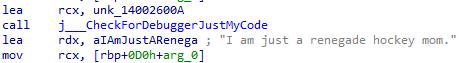
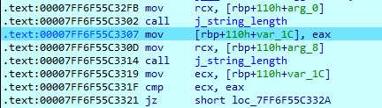
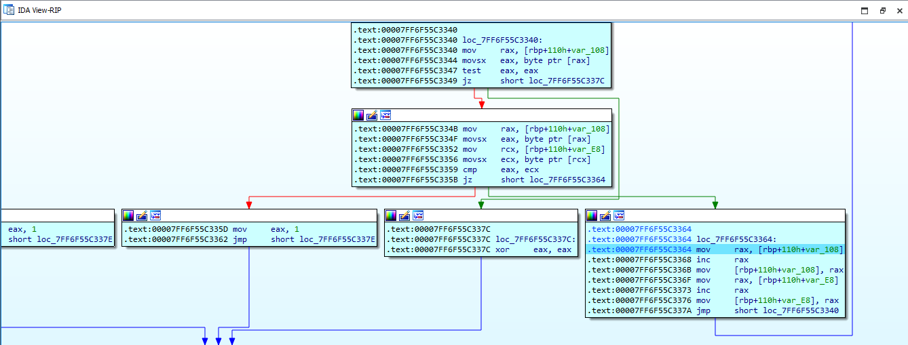

# Phase 1 — String Comparison
 
## Objective
 
Phase 1 takes a user-provided string and compares it against a reference string embedded in the binary. The interesting part of this analysis isn't finding the string itself — it's understanding how the comparison is implemented at the assembly level, since that reveals the exact constraints the input must satisfy.
 
## 1. Identifying the Expected String
 
At the start of `phase_1`, a pointer to the reference string is loaded into `RDX`. The string is:
 
```
I am just a renegade hockey mom.
```
 
The user-provided input is loaded into `RCX`, and the function then calls:
 
```
strings_not_equal
```
 

 
## 2. Inside `strings_not_equal`
 
The first thing `strings_not_equal` does is call `string_length` on both strings.
 
The reference string has a length of:
 
```
0x20 = 32 bytes
```
 

 
The user-provided string's length is computed the same way, and the two lengths are compared before any character-level check happens. If they differ, the strings are immediately considered unequal and the function returns without inspecting the contents.
 
Conceptually:
 
```c
if (strlen(input) != strlen(expected))
    return 1;
```
 
This gives us the first constraint:
 
> **The input must be exactly 32 characters long.**
 
## 3. Byte-by-Byte Comparison
 
If the lengths match, `strings_not_equal` proceeds to a byte-by-byte comparison.
 

 
For each iteration, the function loads the current byte from both strings and checks whether the null terminator has been reached. If a byte pair differs, it returns a non-zero value immediately — there's no need to keep scanning once a mismatch is found. If the bytes match, both pointers are advanced and the next pair is compared.
 
Conceptually, the loop is equivalent to:
 
```c
while (*input != '\0') {
    if (*input != *expected)
        return 1;
 
    input++;
    expected++;
}
 
return 0;
```
 
This is a standard `strcmp`-style equality check — nothing unusual is happening at the instruction level, just length-then-content comparison compiled down to a loop with early exit on mismatch.
 
## 4. The Return Value
 
The return value of `strings_not_equal` is what `phase_1` uses to decide whether the bomb explodes:
 
```
0     → strings are equal
non-0 → strings differ
```
 
So the successful path through `phase_1` requires:
 
```
strings_not_equal(input, expected) == 0
```
 
Which means the required input is simply the reference string itself:
 
```
I am just a renegade hockey mom.
```
 
## Key Takeaway
 
This phase is a straightforward length-then-content string comparison compiled to assembly; no obfuscation beyond the fact that the reference string and the comparison logic have to be reconstructed from the disassembly rather than read directly off the surface.