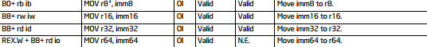
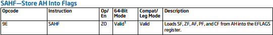
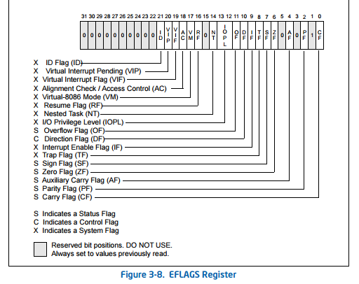
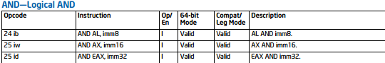
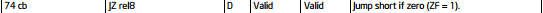
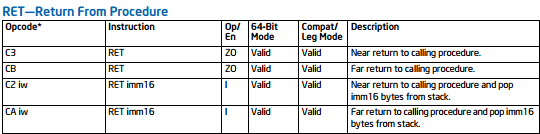
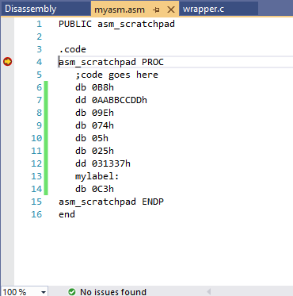
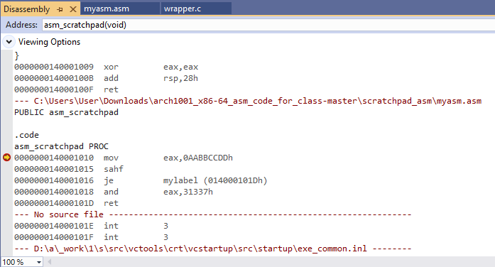

# OpenSecurityTraining2 Arch1001 --- RTFM & WTFI

## Objective

This was one of the OpenSecurityTraining2 labs where we were challenged
to construct a sequence of raw machine-code bytes that produces the
following assembly:

``` asm
mov eax, 0xAABBCCDD
sahf
jz mylabel
and eax, 0x31337
mylabel:
ret
```

Instead of using an assembler to generate the machine code, the
instructions had to be encoded manually using the Intel Software
Developer's Manual and assembler data directives such as `db` and `dd`.


## 1. Encoding `MOV`

The first instruction is:

``` asm
mov eax, 0xAABBCCDD
```

The Intel manual provides the `MOV r32, imm32` encoding:

``` text
B8 + rd id
```



For `EAX`, the register encoding is zero, giving the opcode:

``` text
B8
```

The immediate is a 32-bit value:

``` text
0xAABBCCDD
```

x86 uses little-endian byte ordering, so the immediate is stored as:

``` text
DD CC BB AA
```

Therefore, the complete instruction becomes:

``` text
B8 DD CC BB AA
```

Using assembler data directives:

``` asm
db 0B8h
dd 0AABBCCDDh
```

produces those bytes.

At this point:

``` text
EAX = 0xAABBCCDD
```

## 2. Encoding `SAHF`

The next instruction is:

``` asm
sahf
```

`SAHF` loads selected status flags from the `AH` register.

Its opcode is:

``` text
9E
```



Therefore:

``` asm
db 09Eh
```

is sufficient.

### Understanding the Flags

After the `MOV`:

``` text
EAX = 0xAABBCCDD
```

Since `EAX` is:

``` text
AA BB CC DD
```

the `AH` register contains:

``` text
AH = CC
```

`0xCC` in binary is:

``` text
11001100
```

`SAHF` loads the following flags from specific bits of `AH`:

``` text
SF <- AH[7]
ZF <- AH[6]
AF <- AH[4]
PF <- AH[2]
CF <- AH[0]
```



For:

``` text
AH = 11001100b
```

the relevant values are:

``` text
SF = 1
ZF = 1
AF = 0
PF = 1
CF = 0
```

The important flag for the next instruction is:

``` text
ZF = 1
```

This can also be verified by looking at the disassembly/debugger after
the `SAHF` instruction executes.

## 3. Encoding `AND`

The next instruction is:

``` asm
and eax, 0x31337
```

The Intel manual provides the encoding:

``` text
AND EAX, imm32
```



with opcode:

``` text
25
```

The immediate operand is encoded as a 32-bit value.

Although:

``` text
0x31337
```

only requires three significant bytes, the instruction encoding uses a
32-bit immediate:

``` text
0x00031337
```

Because x86 is little-endian, the bytes are:

``` text
37 13 03 00
```

Using the data directives:

``` asm
db 025h
dd 031337h
```

produces the required bytes.

The complete instruction is therefore:

``` text
25 37 13 03 00
```

## 4. Encoding `JZ`

The instruction is:

``` asm
jz mylabel
```



At this point, the target address depends on the size of the `AND`
instruction, so the `AND` instruction needs to be determined first.

The encoded `AND` instruction is five bytes:

``` text
25 37 13 03 00
```

Therefore, `mylabel` is five bytes after the address of the instruction
immediately following the `JZ`.

For a short conditional jump, the Intel encoding is:

``` text
JZ rel8
```

with opcode:

``` text
74
```

The `rel8` value is a signed 8-bit displacement relative to the address
immediately following the `JZ`.

Here the required displacement is:

``` text
+5
```

so the complete instruction is:

``` text
74 05
```

Using the assembler directives:

``` asm
db 074h
db 05h
```

### Control Flow

After `SAHF`, the Zero Flag is set:

``` text
ZF = 1
```

`JZ` is taken when `ZF = 1`.

Therefore execution jumps over:

``` text
25 37 13 03 00
```

and lands at `mylabel`.

``` text
MOV EAX, 0xAABBCCDD
        |
        v
      SAHF
        |
        v
      ZF = 1
        |
        v
     JZ +5
        |
        | taken
        v
     mylabel
        |
        v
       RET
```

If `ZF` were clear, execution would instead continue to the `AND`
instruction.

## 5. Encoding `RET`

The final instruction is:

``` asm
ret
```



The opcode for the near `RET` instruction is:

``` text
C3
```

Therefore:

``` asm
db 0C3h
```

encodes the return instruction.

## 6. Putting all the instructions together

### MASM-style byte directives



The manually constructed bytes were then assembled and inspected in the debugger mode.

The resulting disassembly shows:

``` asm
mov     eax, 0AABBCCDDh
sahf
je      mylabel
and     eax, 31337h
mylabel:
ret
```



One small detail worth flagging: the debugger shows `JE` instead of `JZ`. That's expected --- `JE` and `JZ` are just two names for the same underlying condition, `ZF = 1`.

## References

-   [Intel® 64 and IA-32 Architectures Software Developer's
    Manual](https://www.intel.com/content/www/us/en/developer/articles/technical/intel-sdm.html)
-   [OpenSecurityTraining2 --- Arch1001 x86-64
    Assembly](https://apps.p.ost2.fyi/learning/course/course-v1:OpenSecurityTraining2+Arch1001_x86-64_Asm+2021_v1/home)
-   [OpenSecurityTraining2 --- RTFM &
    WTFI](https://apps.p.ost2.fyi/learning/course/course-v1:OpenSecurityTraining2+Arch1001_x86-64_Asm+2021_v1/block-v1:OpenSecurityTraining2+Arch1001_x86-64_Asm+2021_v1+type@sequential+block@710f5315e4b541b1ab7fae9d3a348254/block-v1:OpenSecurityTraining2+Arch1001_x86-64_Asm+2021_v1+type@vertical+block@63e7b15b422549f48ec9538fa14027e8)
